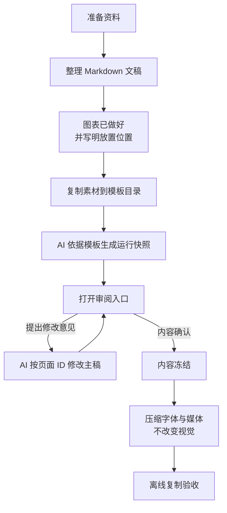

# 演示模板创作流程

> 当前状态：生产流程待 P3 实现；本文先记录目标工作流与 P0/P1 阶段的边界。

输入是一份资料与图表齐全的 Markdown 文稿；AI 按已确认的模板页型生成演示配置；用户审阅并提出自然语言修改意见；内容冻结后再进行字体、媒体和离线打包验收。

## 总览



## 1. 当前进度（P0–P6）

正式流程已实现：

1. P0：文档与状态对齐；
2. P1：八张静态样稿方向确认；
3. P2：空间分镜与渲染器验证，锁定本地 Three.js；
4. P3：Markdown → 运行快照、统一导航、固定画布；
5. P4：八页核心短演示；
6. P5：全部页型与 24 页回归样稿；
7. P6：验证、字体子集、离线复制与文档。

正式入口为 `index.html`，审阅入口为 `review.html`。`test/` 用于保留历史实验与设计证据，不参与运行时。

## 2. 输入：Markdown 文稿

用户只维护一份 Markdown 主稿 [content/sample.md](content/sample.md)，作为唯一人工内容源。文稿写明页面顺序、稳定页面 ID、页型、文字、资源路径、图注和来源。

图表、图片和视频应在进入模板前准备完成；网页负责放置、播放和提供回退，不在播放阶段临时生成研究图或计算结论。

首版允许使用的页型名称包括：

```text
cover
contents
section-divider
headline-points
statement
split-media
chart-focus
process-flow
timeline
comparison
table-focus
video-focus
references
closing
```

示例：

```markdown
## S04 | chart-focus
章节：03 / EVIDENCE
标题：两条曲线说明什么？
图表：assets/charts/trend.svg
图注：合成示例数据，不代表研究结论。
来源：[@source-01]
强调：第三阶段之后出现明显变化。
```

主稿中的资源必须是模板目录内的相对路径，不依赖 `../assets/`、个人绝对路径、CDN 或运行时网络请求。

## 3. 生成与审阅

AI 读取模板契约和 Markdown 主稿，选择已有页型，运行 `python tools/build_content.py` 生成运行快照，并检查页面容量、章节关系、资源路径和引用编号。浏览器在 `file://` 环境中直接读取运行快照，不 fetch Markdown，也不在浏览器内运行编译器。

演示入口 `index.html` 和审阅入口 `review.html` 加载同一份运行快照。用户通过稳定页面 ID 提出修改意见，例如：

```text
S03 的章节命题太长，保留前半句；S04 的图注补充单位；S07 的第三个节点改成“复核来源”。
```

AI 修改 Markdown 主稿并重新检查整场，不把单页截图当作完成标准，也不因内容过长临时创造新的页型。

## 4. 内容冻结

内容确认后冻结：

- 页面顺序、页面 ID、页型和章节编号；
- 全部文字、数字、单位和图表材料；
- 图注、示意边界、引用与来源编号；
- 视频、封面和失败替代说明；
- 首版主题、空间目录和动效档位。

## 5. 压缩与产出

冻结后进行不改变视觉效果的体积整理：

1. 收集实际使用的中英文字符，用 fontTools 生成 WOFF2 子集；
2. 更新 `@font-face` 与主题字体映射，保留字体许可；
3. 压缩图片和视频，移除未使用素材；
4. 只保留实际使用的本地库与其许可证；
5. 检查四张演示用 PNG / JPG 不被误当作模板核心资产，也不因存在于上级素材库而自动打包。

## 6. 离线验收

```text
python tools/build_content.py
python tools/subset_fonts.py
python test/tools/check_formal.py
python test/opening/tools/verify.py
```

正式入口测试覆盖 24 页、全部页型、1920 × 1080 与常见 16:10 视口、空间转场、导航、减少动态、视频生命周期、引用与待补来源、无远程请求。字体子集随目录携带；不要把系统商业字体打包。

最后将整个 `presentation-template/` 文件夹复制到没有开发环境的电脑，断网直接打开 `index.html`，确认相对路径、字体、图表、视频、全屏和错误提示正常。已验证方式：只复制 `index.html`、`review.html`、`content/`、`data/`、`js/`、`styles/`、`assets/`、`vendor/`、`LICENSES/` 到独立目录后仍可完整播放。
