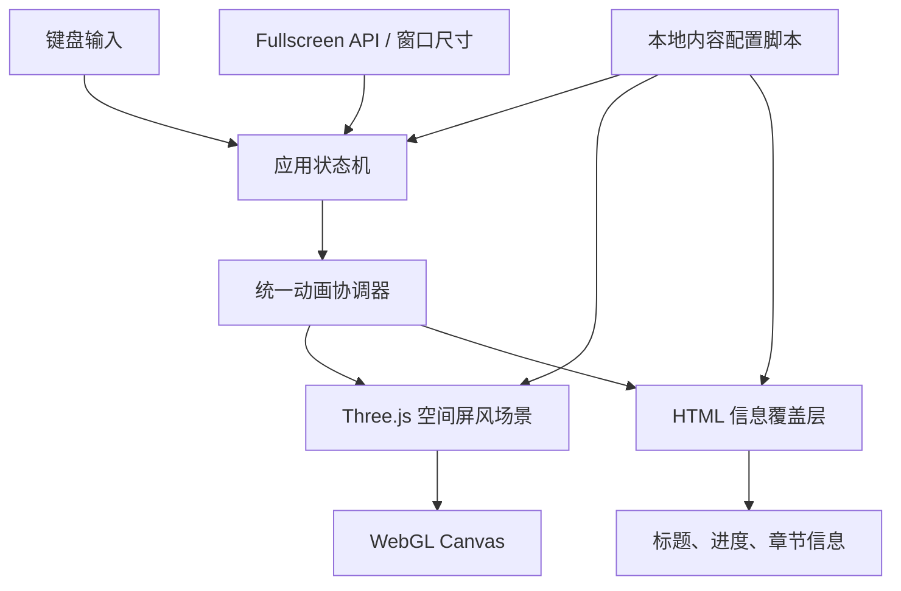
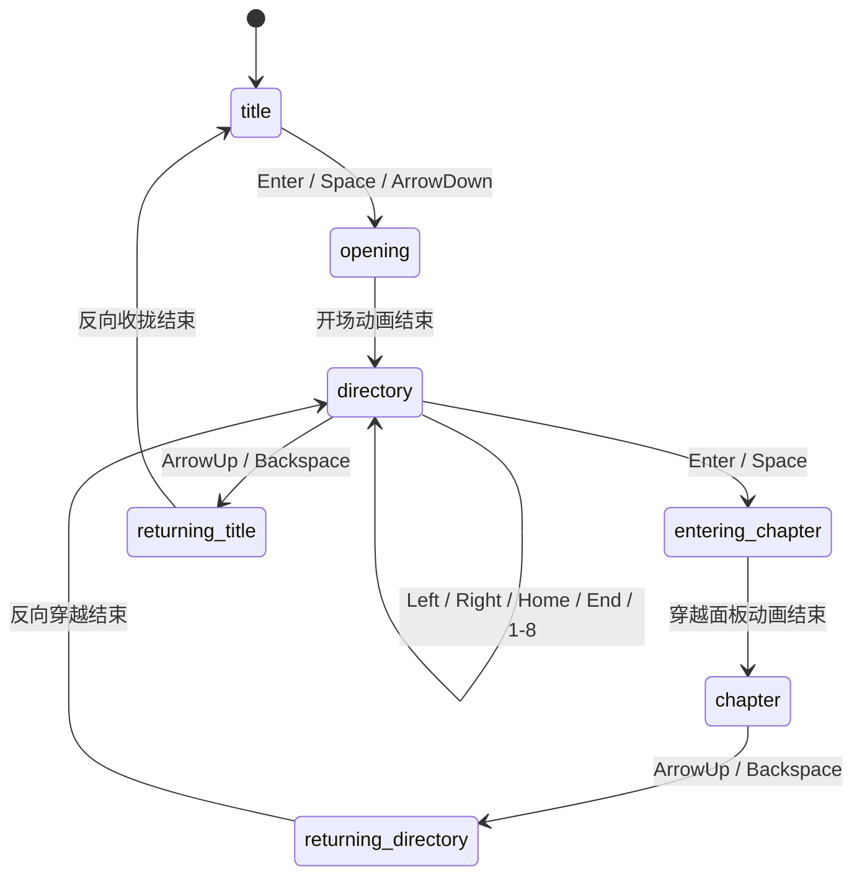

# 演示模板旧原型技术架构（历史参考）

> 文档状态：旧原型技术方案 v0.1；不代表新模板架构已选定。  
> 当前需求：[REQUIREMENTS.md](REQUIREMENTS.md)  
> 架构目标：高视觉质量、完全离线、复制整个文件夹后可直接运行

**适用范围说明**：本文只记录旧玻璃屏风原型的技术实现，保留作历史参考。不得将其中的 Three.js、玻璃材质、青色主题、屏风目录或性能策略直接视为新模板的技术决定。新模板执行顺序见 [IMPLEMENTATION-PLAN.md](IMPLEMENTATION-PLAN.md)，视觉依据见 [DESIGN-DIRECTION.md](DESIGN-DIRECTION.md)。

新模板的视觉基线已定义为暖白、墨黑、砖红的极简编辑式空间叙事，封面到目录需要连续纵深。首版静态样稿及空间分镜确认以前，不决定是否采用 Three.js、CSS 3D 或其他渲染器；不继承旧屏风、玻璃材质或青绿色主题。通用页型、Markdown 内容主稿、导航、媒体、引用与离线能力按 `IMPLEMENTATION-PLAN.md` 的阶段执行。

## 1. 架构结论

首版采用**本地静态网页 + 本地 Three.js WebGL 舞台 + 原生 HTML/CSS 信息层 + 原生 JavaScript 状态机**。

以下 WebGL 选择和理由属于旧屏风原型，不能作为新模板的架构结论。新模板应先根据已确认的静态样稿制作空间分镜，再比较 DOM / CSS 3D 与本地 Three.js；只选择满足构图、可读性、离线运行和静态回退要求的单一正式渲染方案。

页面中的章节标题、进度、辅助信息和错误状态由 HTML 覆盖层渲染，不把可编辑文字烘焙到 WebGL 纹理中。这样既保留舞台效果，也让内容配置和无障碍支持保持简单。



## 2. 技术栈

| 层级 | 选择 | 用途 |
| --- | --- | --- |
| 页面入口 | HTML5 | 本地入口、语义结构、脚本加载顺序 |
| 样式 | 原生 CSS | 全屏舞台、文字排版、界面层、主题变量 |
| 应用逻辑 | 原生 JavaScript | 状态、键盘、全屏、动画调度、配置校验 |
| 三维渲染 | 本地固定版本 Three.js | 相机、面板几何体、深度遮挡、材质和 WebGL 渲染 |
| 面板海报 | 本地图片 + CanvasTexture | 抽象静态主视觉纹理 |
| 当前面板微动效 | ShaderMaterial | 折射光、扫描光带、低频粒子或噪声流动 |
| 全屏 | Browser Fullscreen API | `F` 键进入和退出原生全屏 |
| 运行环境 | 最新版 Chrome / Edge | 本地 `file://` 直接运行 |

首版不使用 React、Vue、TypeScript、Vite、Webpack、CDN、在线字体、远程 API、JSON `fetch()` 或 ES module 动态导入。这些方案会增加构建、部署或 `file://` 环境的不确定性。

## 3. 本地运行设计

### 3.1 基本原则

1. `index.html` 是唯一入口，双击即可在 Chrome 或 Edge 打开。
2. 所有脚本、媒体、字体和第三方库均位于项目文件夹内，并使用相对路径。
3. 内容配置通过普通 `<script>` 标签加载，挂载到 `window.PRESENTATION_CONFIG`；不能使用 `fetch('config.json')`，因为直接打开本地文件时浏览器可能拦截它。
4. Three.js 使用本地的非模块发行文件，例如 `vendor/three.min.js`，通过普通 `<script defer>` 加载。
5. 每个第三方库保留版本号和许可证文件，方便迁移与后续升级。

### 3.2 脚本加载顺序

```html
<script defer src="vendor/three.min.js"></script>
<script defer src="data/presentation.config.js"></script>
<script defer src="js/app.js"></script>
```

所有脚本使用 `defer`，因此会在 HTML 解析完成后按声明顺序执行。首版不拆分为浏览器模块，避免在 `file://` 条件下受到模块跨域规则影响。

## 4. 建议目录结构

```text
presentation-template/
|-- index.html                       # 唯一入口
|-- REQUIREMENTS.md
|-- TECHNICAL-ARCHITECTURE.md
|-- LICENSES/
|   `-- threejs-LICENSE.txt
|-- vendor/
|   `-- three.min.js                 # 固定版本的本地 Three.js
|-- data/
|   `-- presentation.config.js       # window.PRESENTATION_CONFIG
|-- assets/
|   |-- fonts/                       # 本地 woff2 字体
|   |-- images/
|   |   |-- posters/                 # 5 个抽象章节海报
|   |   `-- textures/                # 噪声、渐变、遮罩纹理
|   `-- audio/                       # 后续可选
|-- styles/
|   |-- tokens.css                   # 主题色、尺寸、层级变量
|   |-- base.css                     # 字体、重置、全屏规则
|   `-- overlay.css                  # HTML 信息层
`-- js/
    `-- app.js                       # 首版核心：状态、场景、材质、动画、键盘与全屏
```

文件名和资源路径使用 ASCII、短横线和相对路径，避免在跨电脑复制时出现路径编码或大小写问题。

首版将核心逻辑集中在 `js/app.js`，减少普通脚本间的全局依赖和加载顺序风险。后续章节内容页或主题系统显著扩展时，再按状态、场景、着色器、输入和覆盖层职责拆分为独立文件。

## 5. 页面分层

页面固定为全屏，禁止页面滚动。各层从后到前如下：

```text
0. HTML 基础背景：深黑色，WebGL 初始化失败时仍保持可读
1. 空间舞台：根据已确认分镜承载前中远景、路径、遮挡和过场；正式实现前不锁定渲染器
2. HTML 信息层：封面标题、当前章节编号、标题、进度
3. HTML 状态层：错误状态和无障碍播报区域
```

WebGL Canvas 使用 `position: fixed; inset: 0`，渲染尺寸与 `window.innerWidth`、`window.innerHeight` 同步。像素比使用 `Math.min(window.devicePixelRatio, 2)` 作为上限，避免高 DPI 显示器把无意义的超高像素密度变成稳定性问题；这不是视觉自动降级，而是默认渲染基线。

## 6. 旧原型三维场景设计（历史参考）

### 6.1 场景对象

```text
Scene
|-- WorldGroup
|   |-- ScreenWallGroup             # 全部章节面板，随目录切换整体转动
|   |   |-- ChapterPanel 01
|   |   |-- ChapterPanel 02
|   |   |-- ...
|   |   `-- ChapterPanel 05
|   |-- FloorPlane                  # 极暗反射地面
|   `-- Atmosphere                  # 低密度雾、远景光晕
|-- CameraRig                       # 镜头位置与轻微呼吸
|-- PerspectiveCamera
|-- AmbientLight / DirectionalLight
`-- WebGLRenderer
```

每个 `ChapterPanel` 由四个可独立控制的图层组成：

1. 实体框架：细边框和可感知的厚度。
2. 海报层：本地抽象海报，作为不透明内容基础。
3. 玻璃层：透明 ShaderMaterial，呈现边缘高光、轻微折射和色散。
4. 焦点层：仅当前面板启用，用于低频光带、粒子或反射移动。

### 6.2 弧形环绕布局

以当前章节为弧线中心。章节相对当前索引的偏移量为 `delta`，其空间位置遵循：

```text
theta = delta * stepAngle
x = radius * sin(theta)
z = radius * (1 - cos(theta))
rotationY = -theta
```

`stepAngle`、`radius`、面板宽高、相机距离和相机视角全部归入主题布局参数。当前面板的 `theta` 为 0，正对相机；相邻面板沿圆弧后退并向两侧旋转。真实 WebGL 深度缓冲负责不透明面板的遮挡关系。

玻璃层需要单独处理透明排序：海报与框架先写入深度，玻璃层关闭 `depthWrite` 并在面板排序后绘制。当前面板的焦点层最后绘制，以保证高光不会被错误遮住。

### 6.3 材质与光效边界

- 首版使用定制的轻量玻璃着色器，不直接采用成本较高且行为难控的真实透射材质。
- 玻璃着色器使用菲涅耳边缘高光、噪声扰动、局部色散和环境渐变模拟折射。
- 当前面板的微动效只更新少量 uniform，例如 `time`、`focusStrength` 和 `accentColor`。
- 相邻与远端面板共享静态材质和海报纹理，不运行独立粒子系统或视频。
- 后期效果控制在轻微暗角、色调映射和环境辉光；避免全屏高强度泛光覆盖玻璃材质细节。

## 7. 状态与动画架构

### 7.1 单一状态源

```js
{
  view: 'title' | 'opening' | 'directory' | 'entering-chapter' | 'chapter' | 'returning-directory' | 'returning-title',
  selectedIndex: 0,
  pendingIndex: null,
  isFullscreen: false,
  reducedMotion: false,
  transitionLocked: false
}
```

所有输入先转换为动作，再由状态机决定是否执行。Three.js 场景和 HTML 覆盖层只读取状态和动画输出，不直接处理键盘事件。



全屏不是页面层级，而是覆盖在任意页面状态上的独立显示状态。进入或退出全屏不能改变 `view`、`selectedIndex` 或动画进度。`Escape` 只负责退出浏览器全屏；页面返回由 `ArrowUp` 或 `Backspace` 触发。

### 7.2 页面层级与反向过场原则

- 页面层级只有标题页、空间目录和章节页；全屏不作为层级参与历史记录。
- `ArrowUp` 是首选的上一级操作，`Backspace` 提供同等行为，两个按键在全屏和窗口模式下都有效。
- 返回目录时，镜头沿进入章节的路径反向运动，重新穿过当前面板；返回后保留离开前的章节索引。
- 返回标题时，屏风沿进入目录的路径反向收拢，景深重新加深，标题从背景中恢复清晰。
- 返回动画期间锁定新的层级操作；章节切换可保留至多一个待处理目标。
- 全屏状态在反向过场期间保持不变，避免演示画面因为导航而退出全屏。

### 7.3 动画协调器

动画由单一 `requestAnimationFrame` 循环驱动，避免场景、文字和控件各自运行独立定时器。

每一帧按以下顺序执行：

1. 读取时间差并限制异常的大帧间隔。
2. 更新过场、屏风旋转、相机、材质 uniform 和文字显示进度。
3. 将动画结果同步至 Three.js 对象与 HTML 覆盖层。
4. 渲染 WebGL 场景。

目录切换使用目标值插值：`selectedIndex` 决定目标角度，动画协调器将 `currentAngle` 平滑收敛至目标角度。默认切换时长 850 毫秒，使用自定义 cubic-bezier 或阻尼插值；快速按键至多保留一个 `pendingIndex`。

开场动画、进入章节动画和两条反向返回动画使用明确时间轴，阶段之间允许重叠。减少动态效果模式将时间轴压缩为短淡入和小距离位移，但仍保留页面层级关系。

## 8. 键盘与全屏

| 按键 | 动作 | 状态限制 |
| --- | --- | --- |
| `Enter` / `Space` | 进入目录或当前章节 | 标题页、目录页 |
| `ArrowLeft` / `ArrowRight` | 上一章 / 下一章 | 目录页 |
| `Home` / `End` | 第一章 / 最后一章 | 目录页 |
| `1` 至 `8` | 跳转对应章节 | 目录页 |
| `F` | 切换浏览器原生全屏 | 任意非过场状态 |
| `ArrowUp` / `Backspace` | 返回上一级，并播放反向过场 | 目录页、章节页 |
| `Escape` | 只退出浏览器原生全屏；窗口模式下不改变页面层级 | 任意状态 |

`input.js` 必须阻止会使页面滚动或返回浏览器历史的 `Space`、方向键、`Home` / `End` 和 `Backspace` 默认行为。过场阶段锁定与当前过场冲突的动作，保留一次相邻章节切换请求。

`fullscreen.js` 使用 `document.documentElement.requestFullscreen()` 和 `document.exitFullscreen()`；监听 `fullscreenchange` 与 `resize`，在下一动画帧调用 `scene.resize()` 重算相机投影、渲染尺寸和文字布局。浏览器的 `F11` 触发窗口尺寸变化，页面同样会完成舞台重算。

## 9. 旧原型内容与主题配置（历史参考）

`data/presentation.config.js` 使用 JavaScript 对象，而非远程或本地 JSON 请求：

```js
window.PRESENTATION_CONFIG = {
  presentation: {
    title: '演示标题',
    subtitle: '一句简短说明',
    author: '演讲者',
    date: '2026.09',
    theme: 'editorial-spatial'
  },
  themes: {
    'editorial-spatial': {
      background: '#181617',
      primary: '#B8452E',
      secondary: '#F3EEE5',
      highlight: '#111011',
      glassOpacity: 0,
      ambientStrength: 0.26,
      arcRadius: 12,
      stepAngle: 0.5
    }
  },
  chapters: [
    {
      id: 'chapter-01',
      number: '01',
      title: '章节标题',
      summary: '章节的一句话说明',
      poster: 'assets/images/posters/chapter-01.webp'
    }
  ]
};
```

`app.js` 在初始化时校验主题名称、章节数量、资源路径和标题长度；配置错误时显示可读的本地错误信息。所有海报和纹理在开场前预加载，避免标题页进入目录时出现临时空白纹理。

## 10. 旧原型初始化与错误处理（历史参考）

```text
解析 HTML
  -> 加载本地库与配置脚本
  -> 校验配置
  -> 创建 HTML 覆盖层和 WebGL Renderer
  -> 预加载本地海报与纹理
  -> 建立屏风场景
  -> 首次布局计算
  -> 显示标题页
  -> 等待键盘输入
```

若 WebGL 初始化、配置校验或关键资源加载失败：

- 保留基础深色背景和标题内容。
- 显示当前失败资源的相对路径与简短处理说明。
- 显示静态章节列表，便于演示前定位漏拷或错误命名的文件。
- 不尝试连接网络获取替代资源。

## 11. 旧原型性能策略（历史参考）

视觉效果优先，但稳定的演示比不可预测的高负载效果更重要。首版策略如下：

- 在目标设备的 `1920 x 1080` 原生全屏环境中验证 60 FPS。
- 场景只维护 5 个章节面板；远端面板减少可见内容，不运行焦点动画。
- 海报优先使用 WebP，尺寸按实际显示尺寸准备，避免不必要的超大纹理。
- 不在每帧创建对象、读取布局或重新加载纹理。
- 面板切换只改变对象变换、材质 uniform 和覆盖层文本状态。
- 空间效果逐项在实际演示设备上测量；只保留能维持极简空间层级且不影响文字和数据阅读的效果。
- 页面在后台时停止渲染循环，回到前台后以当前状态恢复。

## 12. 旧原型开发与验证顺序（历史参考）

1. 建立目录和最小 `index.html`，验证双击打开与本地脚本加载。
2. 建立全屏舞台、`F` 键逻辑和尺寸重算。
3. 用纯色面板验证弧形布局、相机、深度遮挡与键盘索引。
4. 加入标题页、开场镜头推进和目录切换动画。
5. 按已确认分镜加入必要的空间对象、路径和轻量动效；不默认加入玻璃材质或海报纹理。
6. 实现镜头穿越面板进入章节的过场骨架。
7. 在 `1920 x 1080`、`2560 x 1440` 与 `16:10` 笔记本窗口检查构图。
8. 复制整个文件夹到无开发环境的另一台电脑，直接打开 `index.html` 完成离线迁移验证。

## 13. 旧原型验收清单（历史参考）

- Chrome 和 Edge 直接打开本地 `index.html` 后，无网络连接仍能显示完整标题与三维目录。
- 浏览器开发者工具中没有任何远程网络请求、CDN 请求或 `file://` 被拦截的模块请求。
- 按 `F`、`F11` 或退出全屏后，场景尺寸、相机投影和屏风位置正确。
- 所有章节切换、进场、返回和全屏动作只通过键盘完成。
- 选定的空间对象、路径和远近层级遮挡顺序正确，且正文和图表保持稳定阅读平面。
- 当前面板轻动态存在但不妨碍标题阅读，也不会在相邻面板上重复运行。
- 复制整个项目文件夹后，不安装任何依赖即可在另一台电脑上完整运行。

## 14. 旧原型后续扩展边界（历史参考)

章节正文页沿用同一个 `Scene` 和 `CameraRig`，避免切换页面时重新初始化 WebGL。章节页面可作为新的场景状态加入，不改变本地文件、全屏、键盘和内容配置的基础架构。

若后续需要更复杂的视觉效果，优先在现有着色器、面板构成和本地素材上扩展；只有在当前架构无法支持时才考虑增加新的本地库。
