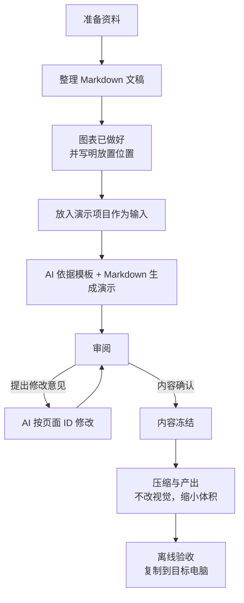

# 演示模板创作流程

输入是一份资料与图表齐全的 Markdown 文稿；AI 按模板生成演示；审阅循环直到内容确认；冻结后在不改变视觉效果的前提下压缩体积，便于复制到其他电脑汇报。

## 总览



## 1. 输入：Markdown 文稿

创作从你自己准备的资料开始，最终形成一份 Markdown 文稿，放入演示项目作为唯一输入。

- 图表、图片、视频已经做好，作为文件一起放进项目；
- 文稿里写明每个资源的放置位置、图注和来源；
- 创建演示时**不再重新画图**，网页只负责放置和播放。

文稿应包含：页面顺序与稳定页面 ID、每页文字、资源相对路径、图注、文献来源。格式示例：

```markdown
## S04 | chart
# 两条曲线，一眼读懂差异。
资源：charts/output/trend.svg
图注：合成示例数据，不代表实验结果。
来源：[@hunter]
- 曲线 A：较早出现峰值。
- 曲线 B：峰值较晚，变化更平缓。
```

浏览器从这份主稿生成预览，当前存放在 `test/content/slides.js`；用户只审阅文字，不编辑 JavaScript。

## 2. AI 生成演示

AI 读取模板与 Markdown 主稿，映射到现有页型，并维护运行配置。用户不手动改代码。

## 3. 审阅循环

审阅入口是 `test/review.html`，样稿入口是 `test/sample.html`。

- 用稳定页面 ID + 自然语言提出修改，例如：
  `S03 的右侧说明太长，删掉第二句；S04 的图例需要更靠近曲线。`
- AI 修改主稿并重新检查整场，不把单页截图当成完成标准。
- 反复“审阅 → 修改”，直到内容完全合适。

## 4. 内容冻结

内容确认后才进入产出阶段，冻结项：

- 页面顺序、页面 ID、页型；
- 全部文字、数字与单位；
- 图表数据、坐标、图注和来源；
- 视频、封面与失败替代说明；
- 文献条目与短引编号；
- 主题、开场预设与目录组合。

## 5. 压缩与产出

冻结后开始，目标是**不改变视觉效果**地缩小体积：

1. 收集文稿实际使用的中英文字符，用 fontTools 生成 WOFF2 子集；
2. 更新 `@font-face` 与主题字体映射，删除或移出不再需要的大字体；
3. 压缩图片与视频，去除未使用的资源；
4. 保留实际需要的字体文件与许可证。

创作阶段可沿用本机字体栈；最终交付必须把字体文件、许可证和引用方式一起检查。

## 6. 离线验收

```text
python test/tools/check.py
```

检查：3D 与开场初始化、多分辨率适配、连续翻页与返回、Plotly 交互与静态回退、减少动态模式、无滚动 / 无 JS 错误 / 无远程请求。

最后把整个 `spatial-presentation/` 文件夹复制到无开发环境的电脑，直接打开入口 HTML，确认相对路径、字体、图表、视频和全屏正常。
